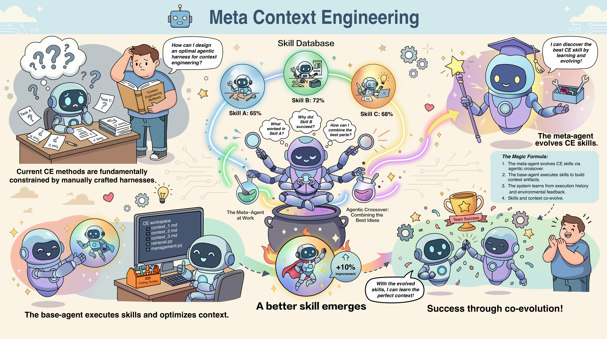
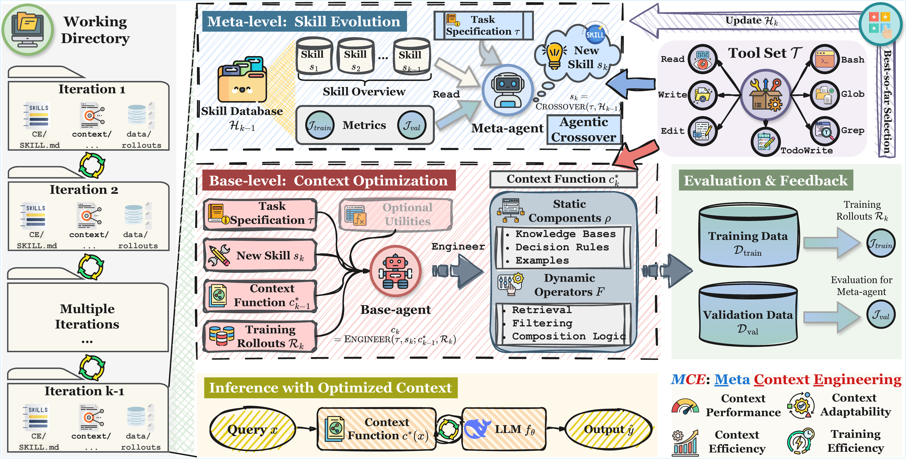

# Meta Context Engineering via Agentic Skill Evolution

> **Superseding Static Harnesses with Learnable Skills for Context Optimization**

[](assets/paper.pdf)
[](https://github.com/metaevo-ai/mce-artifact)
[](LICENSE)
[](https://python.org)

<p align="center">
  
</p>

**Meta Context Engineering (MCE)** is a bi-level agentic framework that co-evolves *context engineering skills* and *context artifacts*, replacing rigid CE heuristics with learnable skills that automatically discover optimal context representations and optimization procedures.

## Key Results

MCE achieves consistent improvements across five diverse domains (finance, chemistry, medicine, law, AI safety):

| Setting | Metric | MCE | Best Baseline | Improvement |
|---------|--------|-----|---------------|-------------|
| **Offline** | Avg. Relative Gain vs Base | **89.1%** | 70.7% (ACE) | +18.4% |
| **Online** | Avg. Relative Gain vs Base | **74.1%** | 41.1% (ACE) | +33.0% |

**Efficiency gains:**
- **13.6×** faster training than ACE
- **4.8×** fewer rollouts required
- **Dynamic context length**: 1.5K to 86K tokens based on task needs

> **Reproduce experiments:** See [mce-artifact](https://github.com/metaevo-ai/mce-artifact) for code and data used in our paper.

## Why MCE?

Current context engineering methods are fundamentally limited by **manually crafted harnesses**, for example:

- **Prompt rewriting** (GEPA) favors brevity → fails on tasks requiring detailed knowledge
- **Additive curation** (ACE) favors verbosity → causes context bloat and overhead
- **Rigid schemas** restrict optimization to narrow, intuition-bound design spaces

**MCE breaks free** by treating the *engineering strategy itself* as a learnable object:

```
Traditional CE:  Fixed workflow → Optimized context
MCE:             Learnable skill + fully agentic CE → Optimized context function 
```

## Method Overview

<p align="center">
  
</p>

MCE formalizes context as a **context function** `c(x) = (F_k ∘ ... ∘ F_1)(x; ρ)`:
- **Static components (ρ)**: Knowledge bases, decision rules, examples
- **Dynamic operators (F)**: Retrieval, filtering, composition logic

### Bi-Level Optimization

**Meta-Level (Agentic Skill Evolution):**
- Analyzes task specification and performance history
- Generates improved skills via *agentic crossover*
- Skills include: methodology, executable code, context templates, dynamic operators

**Base-Level (Fully Agentic Context Optimization):**
- Executes skills to learn from training rollouts
- Produces context as flexible files and code
- No structural constraints on context representation

## Installation

```bash
git clone https://github.com/metaevo-ai/meta-context-engineering
cd meta-context-engineering

# Download uv if not installed
curl -LsSf https://astral.sh/uv/install.sh | sh

# Install with uv
uv sync
```

## Environment Setup

Copy `.env.template` to `.env` and set your API keys:

```bash
cp .env.template .env
```

The system uses **OpenRouter** by default with automatic fallback to **OpenAI**:

```bash
# Option 1: OpenRouter (recommended)
export OPENROUTER_API_KEY="your-api-key"
export OPENROUTER_API_BASE="https://openrouter.ai/api/v1"

# Option 2: OpenAI (fallback if OpenRouter not set)
export OPENAI_API_KEY="your-api-key"
export OPENAI_API_BASE="https://api.openai.com/v1"  # Optional

# To use Claude agent SDK
export ANTHROPIC_API_KEY="your-anthropic-api-key"

# If you are using OpenRouter
export ANTHROPIC_BASE_URL=https://openrouter.ai/api
export ANTHROPIC_AUTH_TOKEN="$OPENROUTER_API_KEY"
export ANTHROPIC_API_KEY=""

# Set default models for Claude agent SDK
export ANTHROPIC_DEFAULT_SONNET_MODEL="minimax/minimax-m2.1"
export ANTHROPIC_DEFAULT_OPUS_MODEL="minimax/minimax-m2.1"
export ANTHROPIC_DEFAULT_HAIKU_MODEL="minimax/minimax-m2.1"
```

## Quick Start

```bash
# Run training on the symptom diagnosis task
bash scripts/train_symptom_diagnosis.sh         # Optimize context for one-step inference
bash scripts/train_symptom_diagnosis_twostep.sh # Optimize context for a two-step workflow
bash scripts/train_symptom_diagnosis_agent.sh   # Optimize context for an agent
```

**Example Results:** Boost DeepSeek V3.1 performance from 45% to 70% accuracy with only 100 training rollouts on symptom diagnosis!

## Project Structure

```
meta-context-engineering/
├── env/                        # Task environments
│   ├── base.py                 # InterfaceSignature, TaskEnvironment
│   ├── registry.py             # Environment registry
│   ├── TUTORIAL.md             # Guide for adding new environments
│   └── symptom_diagnosis*/     # Example environments
├── mce/                        # Core framework
│   ├── main.py                 # Training orchestration
│   ├── meta_agent.py           # Meta-level: skill evolution
│   ├── base_agent.py           # Base-level: context optimization
│   └── validation.py           # Interface validation
├── scripts/                    # Training & evaluation scripts
└── assets/                     # Paper and figures
```

## Adding New Environments

See **[`env/TUTORIAL.md`](env/TUTORIAL.md)** for a comprehensive guide on creating custom task environments.

Quick steps:
1. Create environment directory with data files
2. Implement `TaskEnvironment` subclass
3. Register in `env/registry.py`
4. Create training script and run

## CLI Reference

```bash
uv run python -m mce.main \
    --workspace "workspace/my_task"       # Output directory
    --env "my_task"                        # Environment name
    --train-data "path/to/train.jsonl"    # Training data
    --val-data "path/to/val.jsonl"        # Validation data
    --model "deepseek/deepseek-chat-v3.1" # Inference LLM
    --iterations 3                         # Meta-iterations
    --train-limit 50                       # Training samples
    --val-limit 20                         # Validation samples
```

<!-- ## Citation

If you find this work useful, please cite:

```bibtex

``` -->

## License

MIT License